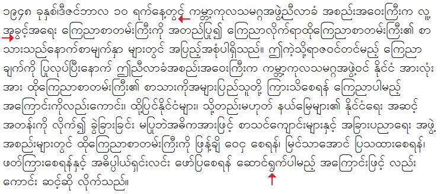
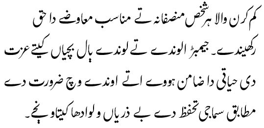

# Graphite font demo

{: .blue-note }
> **Note**
>
> This page requires Firefox 11 or later with Graphite enabled to display correctly. See the [instructions on how to enable Graphite in Firefox](graphite_firefox#switchon). Graphite is also supported in the Pale Moon browser (based on a fork of Firefox).

* [Simple Graphite test](graphite_fontdemo#simple-graphite-test)
* [Padauk font demo](graphite_fontdemo#padauk-font-demo)
    * [Locally installed font](graphite_fontdemo#locally-installed-font)
    * [Normal TrueType font loaded from server](graphite_fontdemo#normal-truetype-font-loaded-from-a-server)
    * [WOFF font loaded from server](graphite_fontdemo#woff-font-loaded-from-a-server)
    * [Graphic showing correct rendering](graphite_fontdemo#graphic-showing-correct-rendering)
* [Awami Nastaliq font demo](graphite_fontdemo#awami-nastaliq-font-demo)

## Simple Graphite test

Here is a simple test to see if Graphite is working in your browser. If it is, the following sentence will be displayed with all consonants in uppercase and all vowels in lowercase. (If only the words FOX and DOG are capitalized, Graphite is not working.)

{: .simple-graphite-ttf }
The quick brown FOX jumps over the lazy DOG.

## Padauk font demo

Padauk is a Graphite-enabled font that supports the Burmese script. This page demonstrates three ways of using Padauk on a web page. A graphic showing the correct rendering of this text is also shown below.

### Locally installed font

Note: you must have Padauk installed on your local computer in order for this sample to work correctly.

[Download Padauk](http://software.sil.org/padauk/){:target="_blank"}{: .btn .btn-blue }

{: .padauk-local }
၁၉၄၈ ခုနှစ်၊ဒီဇင်ဘာလ ၁၀ ရက်နေ့တွင် ကမ္ဘာ့ကုလသမဂ္ဂအဖွဲ့ညီလာခံ အစည်းအဝေးကြီးက လူ့အခွင့်အရေး ကြေညာစာတမ်းကြီးကို အတည်ပြု၍ ကြေညာလိုက်ရာထိုကြေညာစာတမ်းကြီး၏ စာသားသည်နောက်စာမျက်နှာ များတွင် အပြည့်အစုံပါရှိသည်။ ဤကဲ့သို့ရာဇဝင်တင်မည့် ကြေညာချက်ကို ပြုလုပ်ပြီးနောက် ဤညီလာခံအစည်းအဝေးကြီးက ကမ္ဘာ့ကုလသမဂ္ဂအဖွဲ့ဝင် နိုင်ငံ အားလုံးအား ထိုကြေညာစာတမ်းကြီး၏ စာသားကိုအများပြည်သူတို့ ကြားသိစေရန် ကြေညာပါမည့် အကြောင်းကိုလည်းကောင်း၊ ထို့ပြင်နိုင်ငံများ၊ သို့တည်းမဟုတ် နယ်မြေများ၏ နိုင်ငံရေး အဆင့်အတန်းကို လိုက်၍ ခွဲခြားခြင်း မပြုဘဲအဓိကအားဖြင့် စာသင်ကျောင်းများနှင့် အခြားပညာရေး အဖွဲ့အစည်းများတွင် ထိုကြေညာစာတမ်းကြီးကို ဖြန့်ချိ ဝေငှ စေရန်၊ မြင်သာအောင် ပြသထားစေရန်၊ဖတ်ကြားစေရန်နှင့် အဓိပ္ပါယ်ရှင်းလင်း ဖော်ပြစေရန် ဆောင်ရွက်ပါမည့် အကြောင်းဖြင့် လည်းကောင်း ဆင့်ဆို လိုက်သည်။

### Normal TrueType font loaded from a server

{: .padauk-ttf }
၁၉၄၈ ခုနှစ်၊ဒီဇင်ဘာလ ၁၀ ရက်နေ့တွင် ကမ္ဘာ့ကုလသမဂ္ဂအဖွဲ့ညီလာခံ အစည်းအဝေးကြီးက လူ့အခွင့်အရေး ကြေညာစာတမ်းကြီးကို အတည်ပြု၍ ကြေညာလိုက်ရာထိုကြေညာစာတမ်းကြီး၏ စာသားသည်နောက်စာမျက်နှာ များတွင် အပြည့်အစုံပါရှိသည်။ ဤကဲ့သို့ရာဇဝင်တင်မည့် ကြေညာချက်ကို ပြုလုပ်ပြီးနောက် ဤညီလာခံအစည်းအဝေးကြီးက ကမ္ဘာ့ကုလသမဂ္ဂအဖွဲ့ဝင် နိုင်ငံ အားလုံးအား ထိုကြေညာစာတမ်းကြီး၏ စာသားကိုအများပြည်သူတို့ ကြားသိစေရန် ကြေညာပါမည့် အကြောင်းကိုလည်းကောင်း၊ ထို့ပြင်နိုင်ငံများ၊ သို့တည်းမဟုတ် နယ်မြေများ၏ နိုင်ငံရေး အဆင့်အတန်းကို လိုက်၍ ခွဲခြားခြင်း မပြုဘဲအဓိကအားဖြင့် စာသင်ကျောင်းများနှင့် အခြားပညာရေး အဖွဲ့အစည်းများတွင် ထိုကြေညာစာတမ်းကြီးကို ဖြန့်ချိ ဝေငှ စေရန်၊ မြင်သာအောင် ပြသထားစေရန်၊ဖတ်ကြားစေရန်နှင့် အဓိပ္ပါယ်ရှင်းလင်း ဖော်ပြစေရန် ဆောင်ရွက်ပါမည့် အကြောင်းဖြင့် လည်းကောင်း ဆင့်ဆို လိုက်သည်။

### WOFF font loaded from a server

{: .padauk-woff2 }
၁၉၄၈ ခုနှစ်၊ဒီဇင်ဘာလ ၁၀ ရက်နေ့တွင် ကမ္ဘာ့ကုလသမဂ္ဂအဖွဲ့ညီလာခံ အစည်းအဝေးကြီးက လူ့အခွင့်အရေး ကြေညာစာတမ်းကြီးကို အတည်ပြု၍ ကြေညာလိုက်ရာထိုကြေညာစာတမ်းကြီး၏ စာသားသည်နောက်စာမျက်နှာ များတွင် အပြည့်အစုံပါရှိသည်။ ဤကဲ့သို့ရာဇဝင်တင်မည့် ကြေညာချက်ကို ပြုလုပ်ပြီးနောက် ဤညီလာခံအစည်းအဝေးကြီးက ကမ္ဘာ့ကုလသမဂ္ဂအဖွဲ့ဝင် နိုင်ငံ အားလုံးအား ထိုကြေညာစာတမ်းကြီး၏ စာသားကိုအများပြည်သူတို့ ကြားသိစေရန် ကြေညာပါမည့် အကြောင်းကိုလည်းကောင်း၊ ထို့ပြင်နိုင်ငံများ၊ သို့တည်းမဟုတ် နယ်မြေများ၏ နိုင်ငံရေး အဆင့်အတန်းကို လိုက်၍ ခွဲခြားခြင်း မပြုဘဲအဓိကအားဖြင့် စာသင်ကျောင်းများနှင့် အခြားပညာရေး အဖွဲ့အစည်းများတွင် ထိုကြေညာစာတမ်းကြီးကို ဖြန့်ချိ ဝေငှ စေရန်၊ မြင်သာအောင် ပြသထားစေရန်၊ဖတ်ကြားစေရန်နှင့် အဓိပ္ပါယ်ရှင်းလင်း ဖော်ပြစေရန် ဆောင်ရွက်ပါမည့် အကြောင်းဖြင့် လည်းကောင်း ဆင့်ဆို လိုက်သည်။

### Graphic showing correct rendering

The screenshot below shows the expected rendering of the sample text. Notice in particular the tear-drop shaped washwe indicated by the red arrows. These are generated by turning on a feature in the font called "Tear drop style washwe" (ID = 'wtri'). If you do not see the tear-drop shaped washwe in the samples above (ie, the washwes are plain circles), the feature has not been activated, and it is possible that your browser is using OpenType to display Padauk instead of Graphite. (Note that the wrapping of the samples on this page will very likely be quite different than what is shown in the graphic below.)

## Awami Nastaliq font demo

Recent versions of Firefox (43 or later), as well as Pale Moon v26+, include support for Graphite's new automatic collision fixing mechanism, used in a new font called Awami Nastaliq. Here is some text that uses this new mechanism.

{: .awami-ttf }
کم کرن والا ہر شخص منصفانہ تے مناسب معاوضے دا حق رکھیندے۔ جیمبڑ الوندے تے لوندے ٻال بچیاں کیتے عزت دی حیاتی دا ضامن ہووے اتے اوندے وچ ضرورت دے مطابق سماجی تحفظ دے بے ذریاں و لوادھا کیتاو نڄے۔

If your browser supports the automatic collision fixing, the text above should look similar to the screenshot below:

