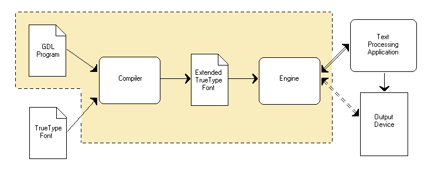

# Graphite technical overview

* [Introduction](graphite_techAbout#introduction)
* [Graphite font tables](graphite_techAbout#graphite-font-tables)
* [Graphite engine implementations](#graphite-engine-implementations)
* [Graphite and OpenType](graphite_techAbout#graphite-and-opentype)

## Introduction

The Graphite system consists of:

* Graphite Description Language (GDL) - a rule-based programming language that is used to describe the behavior of a writing system
* the Graphite compiler - used to compile the GDL program along with a font to generate the Graphite-enabled version of the font
* the Graphite engine - uses the Graphite font to assist a text-processing application in performing text layout

{: .image-tight }

<figcaption>Graphite system architecture</figcaption>

The compiler takes as input a TrueType font and a GDL program that has been written to correspond to it. The output of the compiler is a font that has been extended by including several tables used by the Graphite engine (see [Graphite font tables below](graphite_techAbout#graphite-font-tables)).

An application makes use of Graphite by hooking the Graphite engine into its text layout module. The Graphite engine uses the font, particularly the Graphite-specific tables, to perform text layout.

The dotted arrow between the engine and the output device indicates a difference between the original Graphite engine (SilGraphite) and the Graphite2 rework. The original engine contains a module that actually performs output by communicating with the output device. This is not included in Graphite2; the engine returns glyph and positioning information to the application, which performs the actual drawing.

## Graphite font tables

To create a Graphite-enabled font, the compiler adds several TrueType tables to the font file. These tables include:

* **Silf** - contains the main logic, including finite state machine for rule matching, constraints, and rule action code
* **Glat** - glyph attributes table
* **Gloc** - indexes for Glat table
* **Feat** - feature table, similar to Apple's feat table
* **Sill** - language table, containing mappings between language codes and features

The [&#x2197; compiler package](https://github.org/silnrsi/grcompiler){:target="_blank"} contains more complete documentation of these tables and their formats.

## Graphite engine implementations

There are two existing implementations of the Graphite engine. The original engine is packaged under the name "SilGraphite"; the initial implementation was done in 2000. The Graphite2 engine implementation began in 2010.

The  [&#x2197; SilGraphite engine](https://sourceforge.net/projects/silgraphite){:target="_blank"} is currently used by OpenOffice, XeTeX, FieldWorks, and WorldPad. It includes some features not included in Graphite2, but is considerably slower. [&#x2197; Graphite2](https://projects.palaso.org/projects/graphitedev){:target="_blank"} represents a significant (10x) optimization in terms of speed and greatly improved robustness, but does not include a few features such a ligature component handling and cross-line-boundary contextualization. Graphite2 is used by LibreOffice and Firefox.

The two engines support different APIs. The Graphite2 API was specifically developed to be more compatible with the approach to text layout used by most commercial software. See the [application development page](graphite_devApp) for API documentation.

## Graphite and OpenType

OpenType is the most prevalent smart font technology. Given the extra costs of supporting Graphite in addition to OpenType, what are the gains?

Graphite and OpenType are not competing technologies. Applications may support both Graphite and OpenType rendering and fonts may be developed that work with both Graphite and OpenType.

[Read more...](graphite_aboutOT)