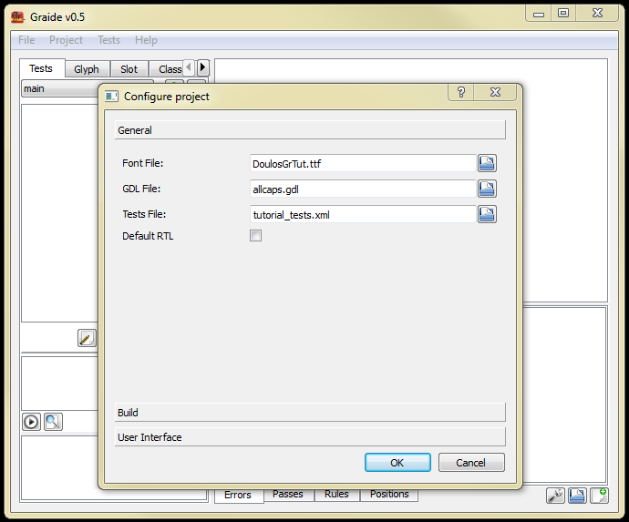
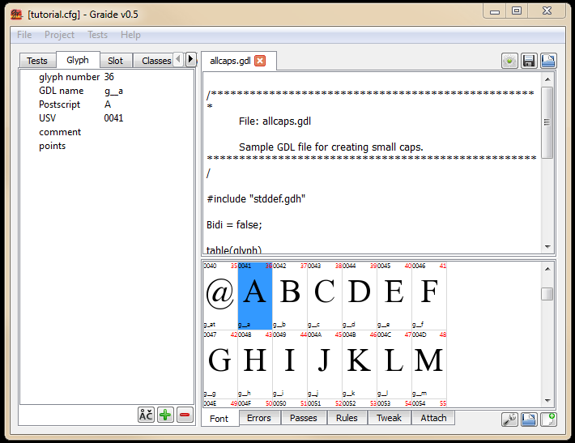
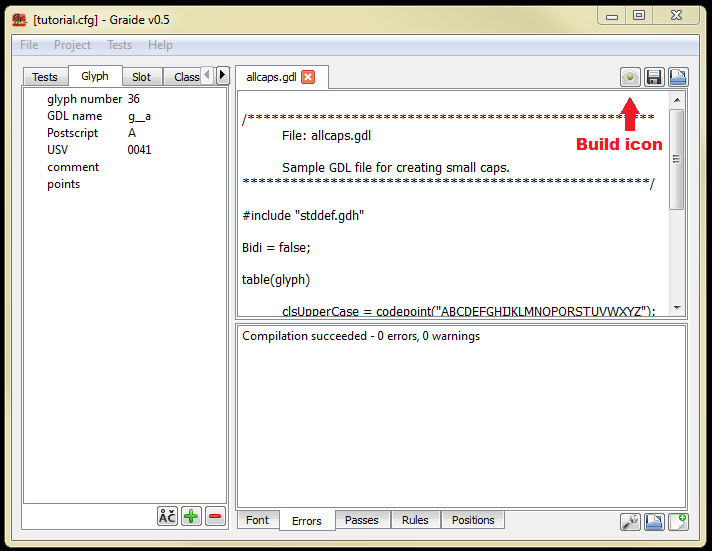
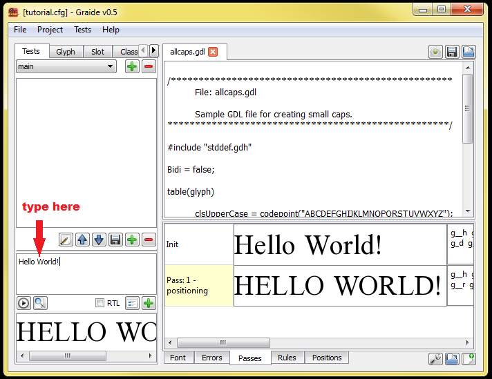

{: .tut-nav-bar }
| [&#x25B2; Contents](../graide_tutorial#contents) | [Unit 2: A very simple GDL program &#x25B6;](graide_tutorial2) |

-----
# Unit 1: Running, installing, and debugging with Graide

[Exercises](graide_tutorial1#exercise-1a)

## Discussion

When you execute the Graide program with no arguments, the first step will be to create a configuration file indicating at minimum the following aspects of your project:

* Font (.TTF) file
* Graphite source code (.GDL) file

Other files that are used or created by Graide include:

* Configuration (.CFG) file
* Test data (.XML) file
* Debugger (.GDX) file
* Font compilation error message file (gdlerr.txt)

## Exercise 1a

**Step 1.** Download the tutorial package.

[Download](../assets/resources/GraphiteTutorialPkg_v6.zip){: .btn .btn-blue }

Create or locate a workspace folder for this tutorial; this is where your fonts and source code files will go. Copy the files called **allcaps.gdl** and **DoulosGrTut.ttf** from the tutorial materials folder into that folder. Make sure the file properties are set to read-write.

**Step 2.** Run graide.exe. Choose the **Project > New Project** menu option. You will be asked for a configuration file. Navigate to your workspace folder and enter the file name as tutorial.cfg. This will create a configuration file with that name.

**Step 3.** A dialog will appear requesting other project details.

* Set the Font File to the DoulosGrTut.ttf file you copied in Step 1.
* Set the GDL File to the allcaps.gdl file you copied in Step 1.
* Set the Tests File to tutorial_tests.xml.

{: .image-tight }


<figcaption>Creating a Graide project</figcaption>

Click OK. The contents of the **allcaps.gdl** file now appears in the code (upper right-hand) pane. In the lower right-hand pane, the Font tab shows the glyphs in the **DoulosGrTut.ttf** font.

**Step 4.** Check your workspace folder. A file has been created called **tutorial.cfg**.

Once your .cfg file exists, you can indicate that Graide should use it initially by including the -p option when you start Graide: `graide -p tutorial.cfg`.

**Step 5.** Find the uppercase A in the Fonts tab (on the lower right-hand pane) and double-click on it. The left-hand pane switches to the Glyph tab and displays the information for the A glyph.

{: .image-tight }


<figcaption>Graide Font and Glyph tabs </figcaption>>

**Step 6.** Build the Graphite tables into the font by clicking the gear icon associated with the code pane. In the lower pane, click on the Errors tab to double-check that there were no errors. (Normally the Error tab will be automatically brought into focus if there are errors.) You should see the text **Compilation succeeded – 0 errors, 0 warnings**. Your workspace folder should now contain a file called DoulosGrTut.gdx.

{: .image-tight }


<figcaption>Building a font in Graide </figcaption>

**Step 7.** Create some test data as follows: Click on the Tests tab again. In the middle (test data) pane, type: Hello world! Click the right-pointing arrow. The bottom (test results) pane shows the results of the Graphite rendering: **HELLO WORLD!**

{: .image-tight }


<figcaption>Running test data in Graide</figcaption>

**Step 8.** Graphite will show you which rules were run in the process of rendering. In the case of this font, there is only one rule in the GDL program. If the Passes tab is not selected, click on it. Double click on the box that says **Pass: 1 - substitution**. Then double-click on any box that says **Rule: 0**. Graide will display and highlight the single rule in the code pane:

```
clsLowerCase > clsUpperCase;
```

{: .image-tight }


<figcaption>Highlighting a rule that was fired</figcaption>

We will begin to learn about rules in Unit 2.

## Exercise 1b

For the second exercise, we will deliberately introduce some errors into the **allcaps.gdl** program and discover how Graide assists in correcting them.

**Step 1.** Click on the Classes tab in the left-hand pane. Double-click on the cell labeled **clsUpperCase**. Notice how the following line is highlighted:

```
clsUpperCase = codepoint(“ABCDEFGHIJKLMNOPQRSTUVWXYZ”);
```

**Step 2.** Change the name of the class to clsUppercase and change the letter “L” in the codepoint function to “X”:

```
clsUppercase = codepoint(“ABCDEFGHIJKXMNOPQRSTUVWXYZ”);
```

(Note that the line does not need to be highlighted in order to edit it; the highlighting is simply a convenient feature of Graide.)

We have now introduced two bugs into the program: a syntactic error (incorrect class name) and a logical error (mismatch between the upper- and lower-case letters).

**Step 3.** Build the font by clicking on the gear icon. The Error tab becomes active with an error message indicating the syntax error:

**allcaps.gdl(23):error(3139): Undefined class name: clsUpperCase**

Double-click on error message, and the rule with the (now) incorrect class name is highlighted.

**Step 4.** Correct either the class definition or the rule so that the names match. Build again by clicking the gear icon. You should see a message saying **Compilation succeeded**.

**Step 5.** Click on the Tests tab in the left-hand pane. If your test data has disappeared from the middle pane, retype it: `Hello world!`. Click the right-pointing arrow icon. You will now see the result of Graphite’s rendering which includes the bug that was introduced: **HEXXO WORXD!**

**Step 6.** If you like, fix the bug in the definition of `clsUppercase`, rebuild and rerun the test to see the correct results.

{: .tut-nav-bar }
| [&#x25B2; Contents](../graide_tutorial#contents) | [Unit 2: A very simple GDL program &#x25B6;](graide_tutorial2) |
