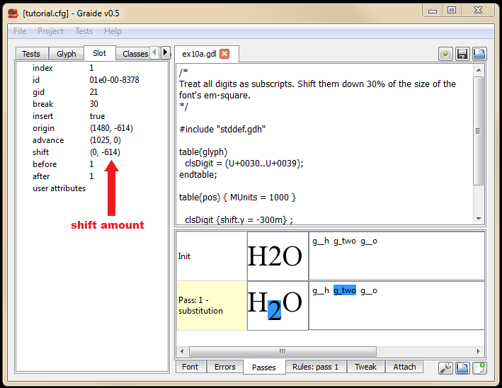

{: .tut-nav-bar }
|  [&#x25C0; Unit 9: Multiple passes per table](graide_tutorial9) | [&#x25B2; Contents](../graide_tutorial#contents) | [Unit 11: Glyph metrics &#x25B6;](graide_tutorial11) |

# Unit 10: Positioning by shifting

[Exercises](graide_tutorial10#exercise-10a)

## Discussion

Until now we have discussed only the substitution table, which is used not only for substitution itself but also for insertion and deletion. Now we are going to shift gears and talk about positioning.

Positioning occurs in the positioning table, indicated by the following syntax:

```
table(pos)
  <rules for positioning>
endtable;
```

The positioning table is always run after the substitution table. Like the substitution table, the positioning table can contain multiple passes. The output of the final pass of the substitution table serves as input to the first pass of the positioning table (except if there is a bidi pass, which comes between them; the bidi pass will be covered in a later unit). If you do not include a positioning table in your program, Graphite will automatically include one positioning pass to position glyphs in the standard way.

There are two ways to make adjustments in position: shifting (including kerning) and attachments. In this unit we discuss the shifting and kerning approach.

Shifting and kerning are performed by means of setting the following slot attributes:

* `shift.x`
* `shift.y`
* `advance.x`
* `advance.y`
* `kern.x`
* `kern.y`

The `shift` attributes adjust the position of the glyph relative to its normal lower-left-hand corner. A positive x value moves the glyph to the right, and a positive y value moves the glyph up. The `advance` attributes adjust the advance width and height of the glyph, which actually have the effect of changing the position of the following glyph. Keep in mind that setting the `shift` attributes alone will have no effect on the position of the following glyph. Kerning—shifting the glyph and adjusting the advance width by an equal amount—can be performed by setting the `kern` attribute, which is actually a short-cut for setting both the `shift` and `advance` attributes.

The values of the `shift`, `advance`, and `kern` attributes are expected to be in units that correspond to the size of the em-square on which the font is based. In your GDL program, you can specify the number of units per em-square using the `MUnits` directive, which can be attached to a table or pass statement as shown:

```
table(pos) { MUnits = 1000 }
```

The above statement defines a “virtual em-square” of 1000 units high and 1000 units wide. To specify a value in terms of the defined scale, follow a number with an ‘m’.

```
shift.x = 500m;
```

The above statement would shift a glyph by half of the width of the font’s em-square. The Graphite compiler scales this number to the actual size of the em-square used in the font, and the engine further scales the resulting number depending on the font size of the text being displayed.

Remember that in the positioning table, because no substitution is occurring, it is not necessary for the rule to include left- and right-hand sides. The syntax is simply:

```
item1 {<set attributes>}  item2 {<set attributes>}  ...  /  <context>;
```

and the context part is optional.

## Exercise 10a

Write a program to treat all digits as subscripts. Shift them downwards 30% of the size of the font’s em-square. (Don’t worry about changing the size of the digits.)

[Solution](graphite_tut_solutions#exercise-10a)

### Exploring Graide: shift attribute in Slot tab

We’ve already seen that user-defined slot attributes are shown in the Slot tab. The shift attributes are examples of system-defined slot attributes that are shown there as well.

Run the following test data: H2O. In the Passses tab, click on the ‘2’ or on g_two in the row labeled “Pass: 1 – positioning”. Notice there is a slot attribute in the Slot tab called “shift”. The value indicates that the glyph has been shifted downward (but not horizontally).

{: .image-tight }


<figcaption>A shifted glyph</figcaption>

However, you should see that the value is not (0, -300) as you might expect, but rather (0, -614). This is because the slot attributes have been scaled to match the em-square of the font itself, rather than the em-units used in the GDL program. The em-square of the font is 2048, thus -300 has been converted to -614.

## Exercise 10b

Write a program to kern the uppercase A when it follows W or V, and vice versa (as in “WAVE”). Experiment to determine the best amount by which to kern.

[Solution](graphite_tut_solutions#exercise-10b)

### Exploring Graide: shift attribute in Slot tab

Run the following test data: `WAVE`. In the Passses tab, click on the ‘A’ in the row labeled **Pass: 1 – positioning**. Notice there is a slot attribute in the Slot tab called “shift” whose value is an (x,y) pair. The x value should be the value you have chosen to kern by, scaled to the em-square of the font.

{: .tut-nav-bar }
|  [&#x25C0; Unit 9: Multiple passes per table](graide_tutorial9) | [&#x25B2; Contents](../graide_tutorial#contents) | [Unit 11: Glyph metrics &#x25B6;](graide_tutorial11) |
