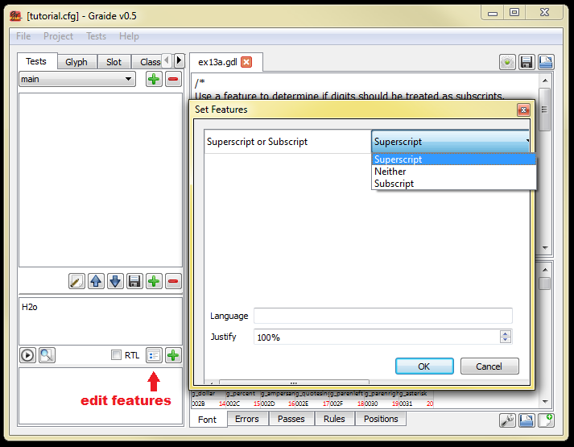

{: .tut-nav-bar }
|  [&#x25C0; Unit 12: Positioning by attachment](graide_tutorial12) | [&#x25B2; Contents](../graide_tutorial#contents) | [Unit 14: Ligatures &#x25B6;](graide_tutorial14) |

# Unit 13: Features

[Exercises](graide_tutorial13#exercise-13a)

## Discussion

Graphite includes a mechanism that allows you to create variations of your writing system. This is accomplished by defining features. The calling application, along with the text to render, sends an indication of the feature settings for the range of text, and rules can be fired conditionally depending on the settings of the features.

Features are defined in the feature table. Each feature has an ID and a list of possible settings. The ID is four-character string or shorter. (Originally IDs were numbers, but that approach is deprecated.) You can also specify natural-language descriptor strings for use in an application’s user interface.

```
table(feature)
  myFeat {
    id = "fea1";
    name.LG_USENG = string("My Feature");
      default = some;
      settings {
        all { value = 4; name.LG_USENG=string("All") }
        many{ value = 3; name.LG_USENG=string("Many") }
        some{ value = 2; name.LB_USENG=string("Some") }
        few { value = 1; name.LG_USENG=string("Few") }
        none{ value = 0; name.LG_USENG=string("None") }
      }
    }
  myBooleanFeat {
    id = "fea2";
    name.LG_USENG = string("My Boolean Feature");
}

endtable;
```

When no settings are defined for a feature, it is considered to be boolean with two settings, true (1) and false (0). The default value for features is assumed to be zero unless otherwise specified.

Rules can be fired conditionally based on the values of features. You can use the `if`, `else`, `elseif`, and `endif` statements to test the values of features.

```
if (myFeat == all)  // parentheses are required
  // rules to fire in the case that myFeat has the value "all"
elseif (myFeat >= few)
  // rules to handle many, some, and few cases
else
  // rules to handle none case
endif;
```

This if mechanism tests that every slot in the rule “passes” the test. To test a single slot in the rule but not the others, you can test for the feature in the rule’s context, as we saw for testing the values of slot and glyph attributes:

```
gA  gB  gC  >  gX  gY  gZ / _  _ {myFeat >= few}  _;
```

In the above rule, only slot #2 is tested for having the given feature value.

Note that it is the GDL feature name that is used in the text, not the ID (eg, we use `myFeat`, not `fea1`).

## Exercise 13a

Extend your program from Exercise 10a. Use a feature with three possible settings to determine if numbers should be treated as subscripts (lowered), treated a superscripts (raised), or left unchanged.

[Solution](graphite_tut_solutions#exercise-13a)

### Exploring Graide: setting features on test data

You can use Graide's control to set features on test data.

{: .image-tight }


<figcaption>Setting a feature on test data</figcaption>

Note that the feature value(s) you set this way will apply to the entire test string.

## Exercise 13b

Extend your program from Exercise 10b to only perform the kerning when the “kern” feature is turned on.

[Solution](graphite_tut_solutions#exercise-13b)

## Exercise 13c

Extend your program from Exercise 4c, 5a, or 6b to either display Roman or Greek text depending on the setting of a feature.

[Solution](graphite_tut_solutions#exercise-13c)

{: .tut-nav-bar }
|  [&#x25C0; Unit 12: Positioning by attachment](graide_tutorial12) | [&#x25B2; Contents](../graide_tutorial#contents) | [Unit 14: Ligatures &#x25B6;](graide_tutorial14) |
