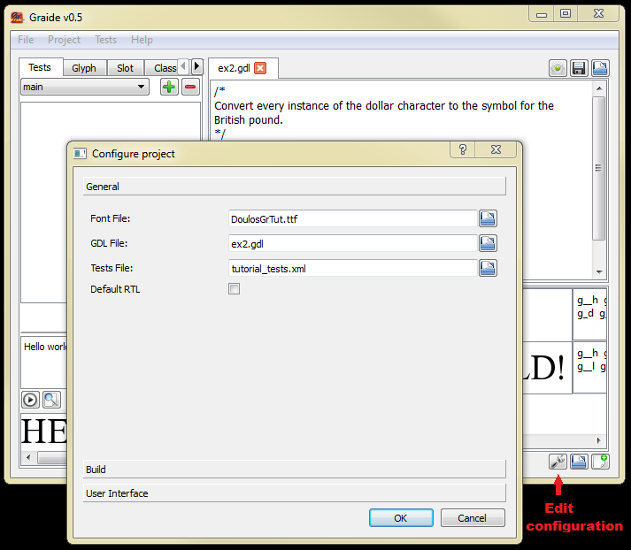

{: .tut-nav-bar }
| [&#x25C0; Unit 1: Running Graide](graide_tutorial1) | [&#x25B2; Contents](../graide_tutorial#contents) | [Unit 3: The glyph table &#x25B6;](graide_tutorial3) |

# Unit 2: A very simple GDL program

[Exercise](graide_tutorial2#exercise-2)

## Discussion

The most fundamental aspect of GDL is the set of rules that define the writing system rendering behavior. The following is an example of a rule:

```
glyphid(68)  >  glyphid(69);
```

This simple rule is made up of two parts: the left-hand side (input) and the right-hand side (output). It says to replace every instance of the letter “a” (glyph 68 in the Doulos Graphite Tutorial font) with the letter “b” (glyph 69).

Note that Graphite only works with glyphs. However, it is frequently easier for the programmer to work with Unicode values. So instead, one could write:

```
unicode(0x61) > unicode(0x62);
```

Graphite still works with the glyphs that these codepoints represent. The Graphite compiler will use the font’s cmap table to replace the Unicode Scalar Values (USVs) with the appropriate glyph IDs in the compiled font.

Notice that hexadecimal numbers (which are the standard way to specify Unicode codepoints) must be prefixed with “0x” within the unicode function. You can also use decimal numbers; the following rule is equivalent to the one above:

```
unicode(97) > unicode(98);
```

An equivalent of the unicode function is the standard syntax for Unicode codepoints:

```
U+0061 > U+0062;
```

Note that is not necessary to include “0x” to indicate that the value is hexadecimal when using this syntax. The “U” must be capitalized.

Another way to reference glyphs is using the postscript function, which identifies a glyph using its Postscript name:

```
postscript(“a”) > postscript(“b”);
```

Note the quote marks surrounding the Postscript name string.

Rules are organized into tables. There are three kinds of tables that contain rules: the linebreak table (abbreviated lb), the substitution table (sub), and the positioning table (pos). The following syntax is used to indicate a table:

```
table(<table-name>)
  <rules in the table>
endtable;
```

Because the rule above is substituting one glyph for another, it would be located in the substitution table.

To access the standard definitions and abbreviations, add the following statement at the beginning of your file:

```
#include “stddef.gdh”
```

## Exercise 2

Write a simple GDL program to convert every instance of the dollar character to the symbol for the British pound. (Note that you are not trying to convert the actual currency values, just the currency symbol itself!) The Unicode codepoint for the dollar is U+0024 and the codepoint for the British pound is U+00A3.

Use Graide to create and debug your new program. Click on the configuration icon to edit the configuration.

{: .image-tight }


<figcaption>Creating a new GDL file</figcaption>

Enter a new GDL file name. You can leave the font name the same (DoulosGrTut.ttf). Click OK and a new tab will open in which for you to enter your code. After writing your GDL, click the gear icon to build the Graphite tables and insert them into the font.

Note that adding the new Graphite tables removes the old behavior implemented in Exercise 1. If you want to preserve the old font, make a separate copy of DoulosGrTut.ttf.

Test your font using some text that includes the dollar sign.

[Solution](graphite_tut_solutions#exercise-2)

{: .tut-nav-bar }
| [&#x25C0; Unit 1: Running Graide](graide_tutorial1) | [&#x25B2; Contents](../graide_tutorial#contents) | [Unit 3: The glyph table &#x25B6;](graide_tutorial3) |
