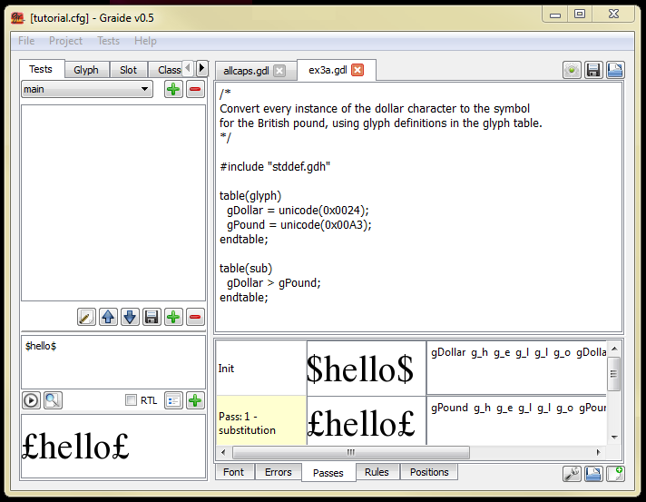
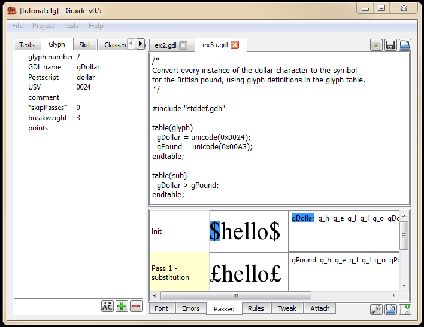
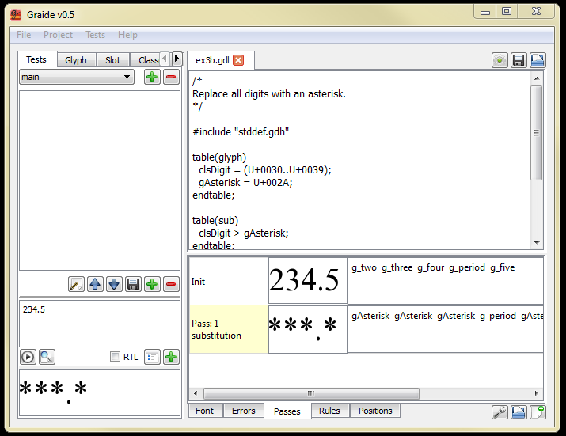
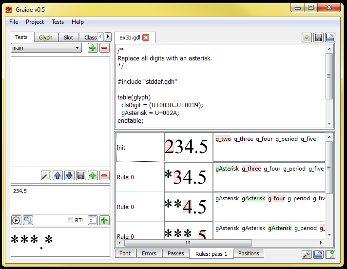
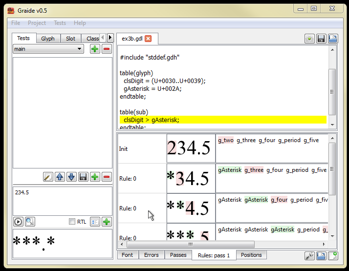

{: .tut-nav-bar }
| [&#x25C0; Unit 2: A very simple GDL program](graide_tutorial2) | [&#x25B2; Contents](../graide_tutorial#contents) | [Unit 4: Corresponding glyph classes &#x25B6;](graide_tutorial4) |

# Unit 3: The glyph table

[Exercises](graide_tutorial3#exercise-3a)

## Discussion

In addition to the tables that contain rules, there are tables containing other information. One of these is the glyph table. Among other purposes, the glyph table can be used to define classes of glyphs, and/or give meaningful names to single glyphs. The glyph table is marked by the following syntax:

```
table(glyph)
  <glyph class definitions>
endtable;
```

The glyph class definitions include lists of glyphs or codepoints that comprise the members of the class. The syntax of the glyph class definition is the following:

```
class-name = <list-of-glyphs>;
```

For instance, you can give names to a group of digit characters as follows:

```
gZero = U+0030;
gOne = U+0031;
gTwo = U+0032;
gThree = U+0033;
gFour = U+0034;
gFive = U+0035;
gSix = U+0036;
gSeven = U+0037;
gEight = U+0038;
gNine = U+0039;
clsDigit = (U+0030..U+0039);
```

Notice the final statement defines a class of glyphs that includes ten digits. It could also have been written as follows:

```
clsDigit = (gZero, gOne, gTwo, gThree, gFour, gFive, gSix, gSeven, gEight, gNine);
```

Parentheses are needed around the list of glyphs when more than one item is included. (Note: the use of an initial “g” to indicate single-glyph definitions and “cls” to indicate multiple-glyph classes is simply a convention.)

In Unit 2 we mentioned briefly that glyphid can be used to reference a glyph directly, i.e.:

```
glyphid(<number>);
```

where the number is the ID of the glyph in the font. (Note that glyphid can be less useful than postscript because it is more font-specific and therefore makes a program that is not as easily converted to work with a different font.)

A fourth way to identify a glyph is using the codepoint function. It takes as an argument either a string that contains a list of characters or a numerical value. The codepage can be included as an optional second argument (Codepage 1252 is the default).

```
codepoint(“a”);
codepoint(97, 1252);
```

As indicated in the example above, the codepoint, unicode, and glyphid functions can specify ranges of values by including the “..” syntax, for instance:

```
clsLowercase = codepoint(97..122);   // a through z
```

(Note that a comment is preceded by two slashes as shown above.) When a glyph has been given a name within the glyph table, that name can be used within a rule in place of the functions. The following is equivalent to the rule discussed in Unit 2 that replaces a’s with b’s.

```
table(glyph)
  g_a = unicode(0x61);
  g_b = unicode(0x62);
endtable;

table(sub)
  g_a  >  g_b;
endtable;
```

## Exercise 3a

Rewrite your program from Exercise 2 to define the dollar and pound glyphs in the glyph table.

[Solution](graphite_tut_solutions#exercise-3a)

### Exploring Graide: the Passes and Glyph tab

After Exercise 3a is correct, let’s take a few minutes to explore a couple features of Graide. Enter the following data in the text data pane: $hello$. Click the right-pointing arrow to run it. The result should look like: **£hello£**.

The Passes pane is displayed automatically. It shows the original glyphs (labeled “Init”) and the result of Graphite’s rendering for each pass. Since there is only one pass in this program, there are two rows in the Passes pane: the original glyphs (“Init”) and the output of Pass 1. The second column shows the glyphs that were output for the pass, and the third column shows the corresponding glyph names.

{: .image-tight }


<figcaption>Passes tab in Graide</figcaption>

Glyph names are the names given to single glyphs in your GDL program. For instance, if your GDL source code included the line

```
gDollar = unicode(0x0024);
```

you will see “gDollar” twice in the third column of the first row.

Click on one instance of “gDollar”, and then click on the Glyph tab. This area shows basic information about the dollar (‘$’) glyph from the font and your GDL program.

{: .image-tight }


<figcaption>Passes and Glyph tab in Graide</figcaption>

You can also click on the glyph itself in the second column of the Passes tab to select it. But notice that you must carefully click on the black part of the glyph; clicking on white pixels inside or near the glyph will have no effect. (So clicking on the glyph name in the third column may be easier!)

Notice that some of the glyphs in your test data were not given names in your GDL program. For these glyphs Graide generates a name based on the Postscript name from the font. The autogenerated name has “g_” prepended, and any uppercase letters are replaced by an underscore plus the lowercase letter. For instance:

| Glyph | Postscript name | Graide name |
|:------|:----------------|:------------|
| a     | a               | g_a         |
| B     | B               | g__b        |
| 5     | five            | g_five      |
| (     | parenleft       | g_parenleft |
| È     | Egrave          | g__egrave   |

## Exericse 3b

Write a program to replace all digits with an asterisk. Use the glyph table to define a class containing the digit characters.

[Solution](graphite_tut_solutions#exercise-3b)

### Exploring Graide: the Passes and Glyph tab

After Exercise 3b is correct, let’s explore another feature of Graide. Enter the following test data: 234.5; click the arrow to render it. The result should be: **\*\*\*.\***.

{: .image-tight }


<figcaption>Passes tab</figcaption>

The Passes pane is displayed automatically. It shows the initial glyphs and the result of Graphite’s rendering for the single pass in this program.

The row labeled **Pass: 1 – substitution** is highlighted in yellow, indicating that there was at least one rule matched in that pass. When you double-click on the yellow cell, the Rules tab appears. Each row of the Rules pane corresponds to one instance of a rule that was matched in pass 1. For this example, if your code looks like the supplied solution, all the rows are labeled **Rule: 0** since that is the only rule in the program.

{: .image-tight }


<figcaption>Rules tab</figcaption>

Note that the output of any rule becomes the input to the next rule fired. So the glyphs shown in row 2 are the output of the first application of the rule, but are also the glyphs that are matched in order to fire the rule the second time.

In each row, the glyphs that are generated—that is, modified—by a rule are highlighted in green. For this program, these are the asterisks. The glyphs that were matched in the previous row are highlighted in pink. As you can see, each row in the Rules tab represents an instance of **Rule 0** applied to successive glyphs in the data.

Double-clicking on any of the cells labeled Rule: 0 will highlight the rule in the code pane.

{: .image-tight }


<figcaption>Highlighting a rule from the Rules tab</figcaption>

{: .tut-nav-bar }
| [&#x25C0; Unit 2: A very simple GDL program](graide_tutorial2) | [&#x25B2; Contents](../graide_tutorial#contents) | [Unit 4: Corresponding glyph classes &#x25B6;](graide_tutorial4) |
