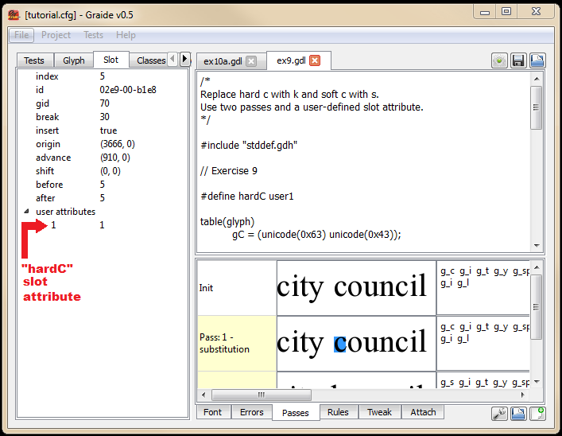

{: .tut-nav-bar }
|  [&#x25C0; Intermission](graide_tutorial8a) | [&#x25B2; Contents](../graide_tutorial#contents) | [Unit 10: Positioning by shifting &#x25B6;](graide_tutorial10) |

# Unit 9: Multiple passes per table

[Exercise](graide_tutorial9#exercise-9)

## Discussion

So far we have been introduced to the substitution table, and have briefly mentioned the existence of other tables containing rules. However it is also possible to have multiple passes per table. These are created by the using the pass and endpass statements. The first pass should be numbered 1, and the output of each pass becomes input to the following pass.

```
table(sub)

pass(1)
  <rules for pass 1>
endpass;

pass(2)
  <rules for pass 2>
endpass;

endtable;
```

## Exercise 9

Rewrite your program from Exercises 6a and 7 using slot attributes and two passes. The first pass sets a user-defined slot attribute called “hardC”, based on the context in which the c is encountered. Note: there is no need to include the > syntax when all you are doing is setting a slot attribute. Use the following syntax:

```
<glyph-class> { <set slot attribute> }  /  <context>;
```

In the second pass, test the value of hardC and perform the appropriate substitution.

Have you observed any subtle differences among the results of Exercises 6a, 7, and 9? Does the suggested approach to Exercise 9 introduce a bug? What is the best way to fix it?

[Solution](graphite_tut_solutions#exercise-9)

### Exploring Graide: multiple passes

As you would expect, when you have multiple passes in your GDL program, extra rows appear in the Passes tab. When there are two passes, there are three rows in the pane, one for the initial input, and one containing the output of each pass. When you double-click on a pass, the label on the Rules tab will indicate which pass the rules belong to.

### Exploring Graide: slot attributes

The actual name of the slot attribute you defined, “hardC”, is not shown in Graide. This is because it has been replaced with the generic user-defined slot attribute name by the GDL preprocessor, e.g., “user1”. However, a list of user attributes is shown in the Slot tab. If you defined your slot attribute using

```
#define hardC user1
```

your slot attribute is number 1 in the list.

The first ‘c’ in “council” is an instance of a hard C. You should have run a rule in your GDL program that sets hardC to true for this glyph. Click on the green-highlighted glyph that was modified by this rule. The value of user attribute #0 should be 1.

{: .image-tight }


<figcaption>Examining a user-defined slot attribute in Graide</figcaption>

Now click on the pink-highlighted glyph just above. The value of user attribute #0 now shows as 0. This indicates that the rule changed the value of the slot attribute from 0 to 1.

(If you are not seeing these results, it could be because your GDL program is substantially different from the supplied solution. It may be helpful to replace your program with the supplied one in order to experiment with Graide.)

{: .tut-nav-bar }
|  [&#x25C0; Intermission](graide_tutorial8a) | [&#x25B2; Contents](../graide_tutorial#contents) | [Unit 10: Positioning by shifting &#x25B6;](graide_tutorial10) |